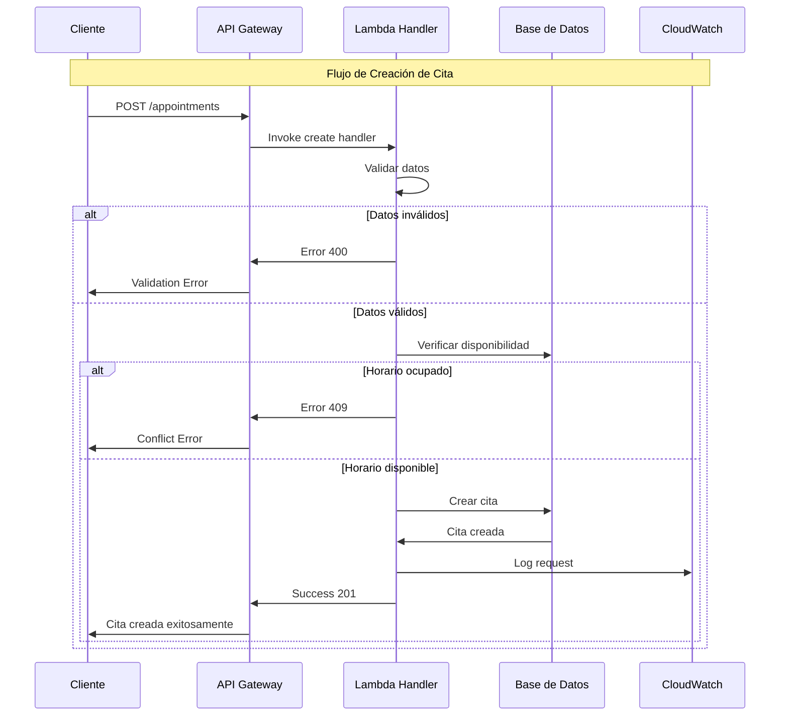
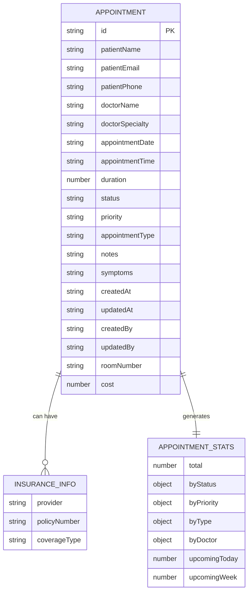
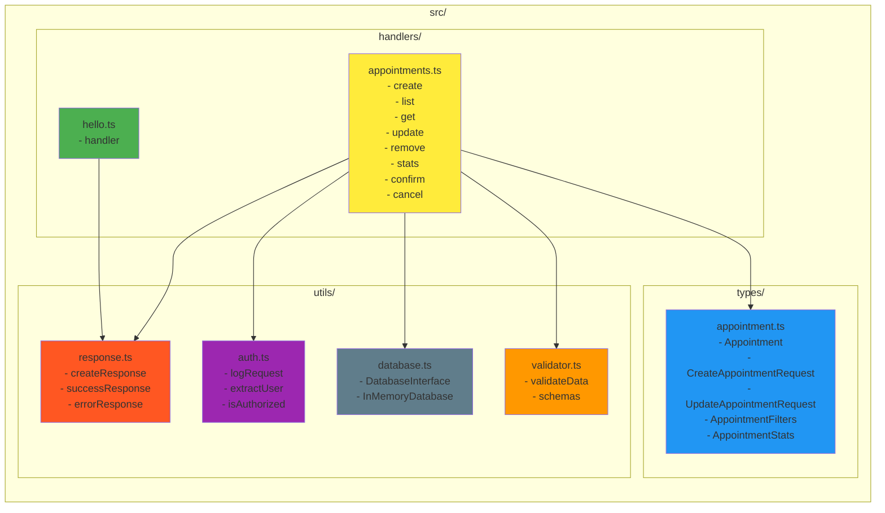
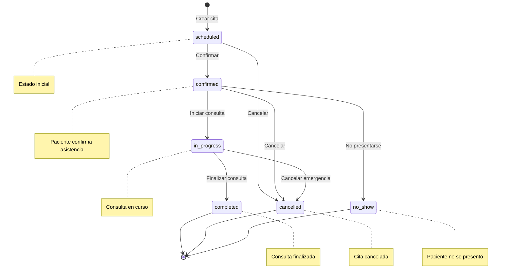
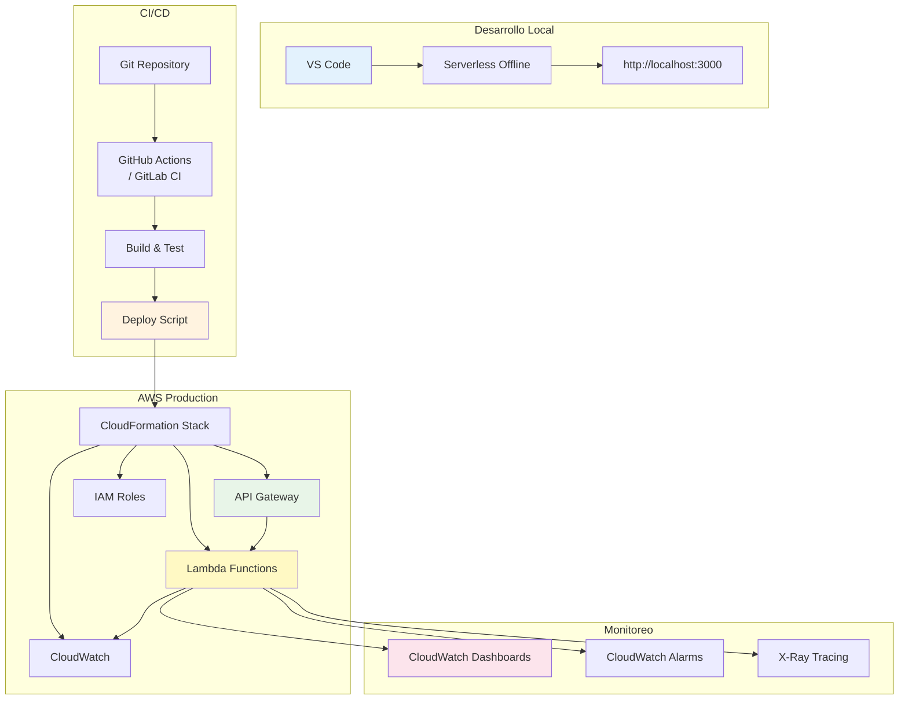
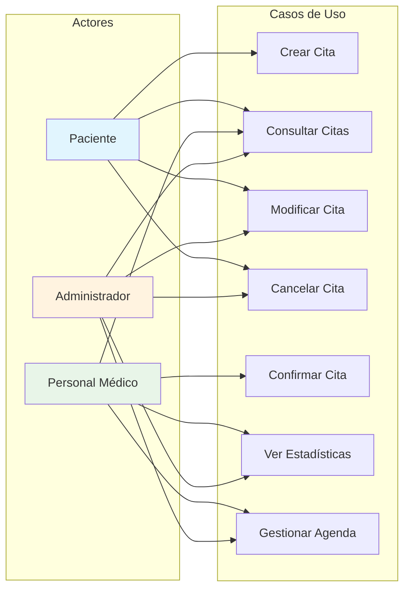
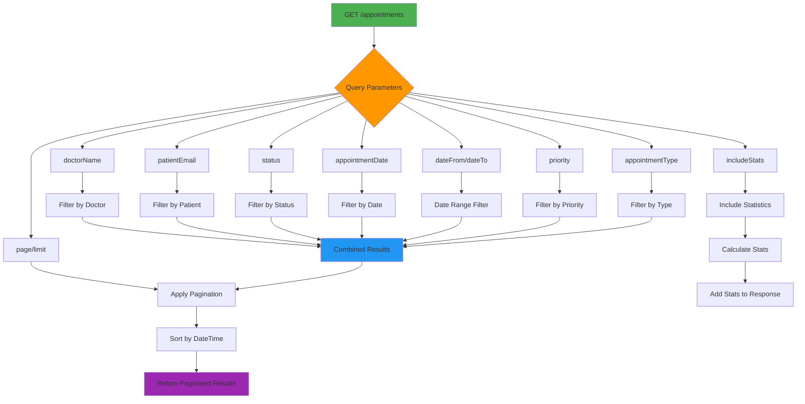

# Sistema de Gestión de Citas Médicas - Diagrama de Arquitectura

## 🏗️ Diagrama de Arquitectura Serverless

```mermaid
graph TB
    subgraph "Cliente"
        A[Frontend Web/Mobile] --> B[HTTP Requests]
    end

    subgraph "AWS Cloud"
        B --> C[API Gateway]
        
        subgraph "Lambda Functions"
            C --> D[Hello Handler<br/>GET /hello]
            C --> E[Create Appointment<br/>POST /appointments]
            C --> F[List Appointments<br/>GET /appointments]
            C --> G[Get Appointment<br/>GET /appointments/{id}]
            C --> H[Update Appointment<br/>PUT /appointments/{id}]
            C --> I[Delete Appointment<br/>DELETE /appointments/{id}]
            C --> J[Get Stats<br/>GET /appointments/stats]
            C --> K[Confirm Appointment<br/>PATCH /appointments/{id}/confirm]
            C --> L[Cancel Appointment<br/>PATCH /appointments/{id}/cancel]
        end
        
        subgraph "Almacenamiento"
            M[In-Memory Store<br/>(Temporal)]
            N[DynamoDB<br/>(Producción)]
        end
        
        subgraph "Observabilidad"
            O[CloudWatch Logs]
            P[CloudWatch Metrics]
        end
        
        D --> M
        E --> M
        F --> M
        G --> M
        H --> M
        I --> M
        J --> M
        K --> M
        L --> M
        
        E -.-> N
        F -.-> N
        G -.-> N
        H -.-> N
        I -.-> N
        
        E --> O
        F --> O
        G --> O
        H --> O
        I --> O
        J --> O
        K --> O
        L --> O
        
        E --> P
        F --> P
        G --> P
        H --> P
        I --> P
    end

    style A fill:#e1f5fe
    style C fill:#fff3e0
    style M fill:#f3e5f5
    style N fill:#e8f5e8
    style O fill:#fce4ec
    style P fill:#fce4ec
```

## 🔄 Diagrama de Flujo de Datos



## 📊 Diagrama de Modelo de Datos



## 🔧 Diagrama de Componentes



## ⚡ Diagrama de Estados de Cita



## 🚀 Diagrama de Despliegue



## 📱 Diagrama de Casos de Uso



## 🔍 Diagrama de Filtros y Búsqueda



---

## 📝 Notas sobre la Arquitectura

### ✅ **Ventajas de la Arquitectura Serverless:**
- **Escalabilidad automática**: Se adapta a la demanda
- **Sin gestión de servidores**: AWS maneja la infraestructura
- **Costos por uso**: Solo pagas por las invocaciones
- **Alta disponibilidad**: Distribuido en múltiples AZ
- **Rápido desarrollo**: Framework Serverless facilita despliegue

### 🔄 **Para Producción se Recomienda:**
- **DynamoDB**: Base de datos NoSQL escalable
- **Autenticación**: JWT con Amazon Cognito
- **Rate Limiting**: Para prevenir abuso
- **Monitoreo**: Dashboards y alertas personalizadas
- **Tests**: Cobertura completa de pruebas
- **Cache**: ElastiCache para consultas frecuentes